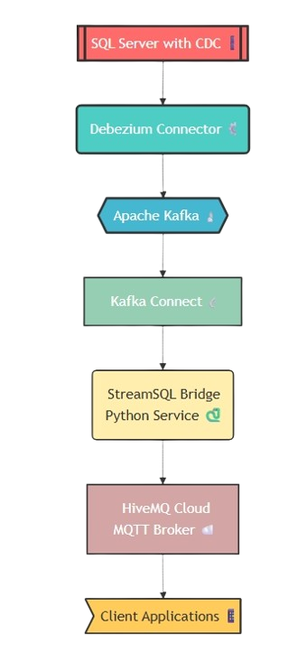
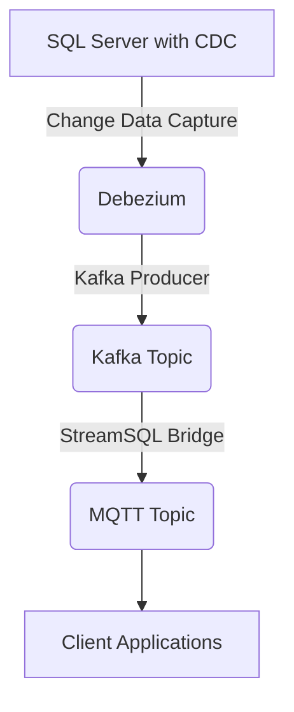

# StreamSQL - Real-time Database Change Pipeline

This project implements a Change Data Capture (CDC) pipeline using Kafka, Debezium, and MQTT integration. The system monitors database changes and streams them to various consumers in real-time.

## Architecture Overview



### Component Flow



## Components

- **SQL Server with CDC**: Source database with Change Data Capture enabled.
- **Debezium**: Captures database changes and streams them to Kafka.
- **Apache Kafka**: Message broker for reliable data streaming.
- **Kafka Connect**: Framework for connecting Kafka to external systems.
- **StreamSQL Bridge**: Python service that forwards messages from Kafka to MQTT.
- **HiveMQ Cloud**: MQTT broker for distributing messages to client applications.

## Prerequisites

- Docker and Docker Compose
- Python 3.8 or higher
- Required Python packages:
  - `paho-mqtt` (MQTT client for Python)
  - `pykafka` (Kafka client for Python)
- SQL Server with CDC enabled
- Network access to SQL Server and HiveMQ Cloud

### Python Package Installation

Install the required Python packages:

```bash
pip install paho-mqtt pykafka
```

## Getting Started

### 1. Clone the Repository

```bash
git clone https://github.com/Leptons1618/StreamSQL.git
cd streamsql
```

### 2. Configure Environment Variables

Create a `.env` file in the project root and configure the following variables (refer to `.env_example` for details):

```plaintext
# Database Configuration
DB_HOSTNAME=your-db-server-address
DB_PORT=1433
DB_USER=your-db-username
DB_PASSWORD=your-db-password
DB_NAME=your-database-name
DB_SERVER_NAME=logical-server-name

# Tables to Monitor
TABLE_INCLUDE_LIST=schema.table_name

# Kafka Configuration
KAFKA_BOOTSTRAP_SERVERS=kafka:29092
HISTORY_TOPIC=dbhistory.sql-server-cdc
TOPIC_NAME=your-topic-name
RECOVERY_POLL_INTERVAL_MS=5000
RECOVERY_ATTEMPTS=4
TASKS_MAX=1
SNAPSHOT_MODE=initial

# Topic Creation Settings
TOPIC_CREATION_REPLICATION_FACTOR=1
TOPIC_CREATION_PARTITIONS=1
TOPIC_CREATION_ENABLE=true

# MQTT Configuration
MQTT_BROKER=your-mqtt-broker.hivemq.cloud
MQTT_PORT=8883
MQTT_USERNAME=your-mqtt-username
MQTT_PASSWORD=your-mqtt-password
MQTT_TOPIC=your/mqtt/topic
```

### 3. Start the Infrastructure

Use Docker Compose to start the services:

```bash
docker-compose up -d
```

### 4. Configure SQL Server Connector

Edit the `mssql-source-connector.json` file with your SQL Server details:

```json
{
    "database.hostname": "your-db-server",
    "database.port": "1433",
    "database.user": "your-username",
    "database.password": "your-password",
    "database.dbname": "your-database",
    "database.server.name": "your-server-name",
    "table.include.list": "schema.table_name"
}
```

Register the connector with Kafka Connect:

```bash
curl -i -X POST -H "Accept:application/json" -H "Content-Type:application/json" --data @mssql-source-connector.json http://localhost:8083/connectors
```

### 5. Start the StreamSQL Bridge

Run the Kafka-MQTT bridge:

```bash
python kafkaHiveBroker.py
```

## Monitoring and Management

- Access the Kafka UI at [http://localhost:8080](http://localhost:8080).
- Monitor Kafka Connect at [http://localhost:8083](http://localhost:8083).
- Check HiveMQ Cloud dashboard for MQTT message statistics.

## Troubleshooting

### Common Issues

- **No messages flowing**: Verify SQL Server CDC is properly configured.
- **Connector failures**: Check Kafka Connect logs for detailed error messages.
- **MQTT connection issues**: Verify credentials and network connectivity.

### Viewing Logs

```bash
docker logs streamsql_kafka-connect_1
```

## License

MIT

## Contact

For questions or support, please contact [anishgiri163@gmail.com](mailto:anishgiri163@gmail.com).