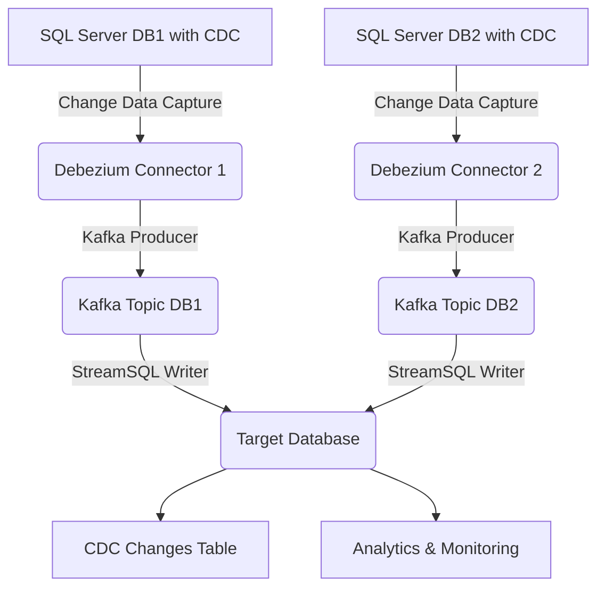

[](https://medium.com/@anishgiri163/streamsql-a-step-by-step-guide-to-real-time-database-change-streaming-3f4d2bed9af6?source=friends_link&sk=cf8493763f708f50744b7e4ca8f945cf)

# StreamSQL - Real-time Database Change Pipeline

StreamSQL is a robust Change Data Capture (CDC) pipeline that leverages Kafka and Debezium to monitor and stream database changes from multiple SQL Server databases in real-time. This project enables seamless integration between multiple SQL Server databases, capturing changes and consolidating them into a centralized database for analysis and monitoring.

## Table of Contents
- [StreamSQL - Real-time Database Change Pipeline](#streamsql---real-time-database-change-pipeline)
  - [Table of Contents](#table-of-contents)
  - [Overview](#overview)
  - [Architecture](#architecture)
  - [Components](#components)
  - [Prerequisites](#prerequisites)
  - [Installation](#installation)
    - [1. Clone the Repository](#1-clone-the-repository)
    - [2. Install Dependencies](#2-install-dependencies)
  - [Setting Up Sample Databases with CDC](#setting-up-sample-databases-with-cdc)
    - [1. Create Sample Databases](#1-create-sample-databases)
    - [2. Enable CDC on Source Databases](#2-enable-cdc-on-source-databases)
    - [3. Set Up Target Database](#3-set-up-target-database)
    - [4. Configure SQL Server Agent](#4-configure-sql-server-agent)
    - [5. Test CDC on Source Databases](#5-test-cdc-on-source-databases)
  - [Dynamic Multi-Database Support](#dynamic-multi-database-support)
    - [Key Features](#key-features)
    - [Topic Naming Convention](#topic-naming-convention)
    - [Configuration Example](#configuration-example)
    - [Management Tools](#management-tools)
  - [Configuration](#configuration)
    - [Notes:](#notes)
  - [Running the Pipeline](#running-the-pipeline)
  - [Monitoring and Management](#monitoring-and-management)
    - [Viewing CDC Changes](#viewing-cdc-changes)
    - [Viewing Logs](#viewing-logs)
  - [Troubleshooting](#troubleshooting)
    - [Common Issues](#common-issues)
    - [Debugging Tips](#debugging-tips)
  - [Utility Scripts](#utility-scripts)
    - [Management Tools (New!)](#management-tools-new)
    - [Database Testing Scripts](#database-testing-scripts)
    - [Configuration Templates](#configuration-templates)
    - [Legacy Components](#legacy-components)
    - [Usage Example](#usage-example)
  - [Contributing](#contributing)
  - [License](#license)
  - [Contact](#contact)

## Overview
StreamSQL captures real-time changes from multiple SQL Server databases using Change Data Capture (CDC) and streams them through Apache Kafka to a centralized target database. This enables comprehensive monitoring and analysis of database changes across your infrastructure, making it ideal for scenarios like data synchronization, audit logging, change tracking, and compliance monitoring.

## Architecture
The pipeline follows a modular architecture to ensure scalability and reliability:



## Components
- **Multiple SQL Server Sources with CDC**: Source databases where Change Data Capture is enabled to track changes.
- **Debezium Connectors**: Multiple CDC connectors that capture row-level changes from each source database and stream them to dedicated Kafka topics.
- **Apache Kafka**: A distributed message broker ensuring reliable and scalable data streaming with separate topics for each source database.
- **Kafka Connect**: A framework for integrating Kafka with external systems like Debezium.
- **StreamSQL Database Writer**: A custom Python service that consumes from multiple Kafka topics and writes all changes to a centralized target database.
- **CDC Changes Table**: A centralized table that stores all database changes with metadata for tracking and analysis.

## Prerequisites
Before setting up StreamSQL, ensure you have:
- **Docker** and **Docker Compose** installed.
- **Multiple SQL Server instances** (2019 or later) with CDC enabled on the source databases and tables.
- **One target SQL Server database** where consolidated changes will be stored.
- Network access to all SQL Server instances.
- **SQL Server Management Studio (SSMS)** or another SQL client for database setup.
- Basic knowledge of Kafka and database administration.

## Installation
Follow these steps to set up the StreamSQL pipeline:

### 1. Clone the Repository
```bash
git clone https://github.com/Leptons1618/StreamSQL.git
cd StreamSQL
```

### 2. Install Dependencies
Ensure Docker and Docker Compose are installed. No additional dependencies are required, as all services are containerized.

## Setting Up Sample Databases with CDC
To test StreamSQL, you can create sample SQL Server databases and enable CDC. Follow these steps using SQL Server Management Studio (SSMS) or a similar SQL client.

### 1. Create Sample Databases
Connect to your SQL Server instances and run the following SQL script to create sample databases and tables. You'll need to do this on both source databases (DB1 and DB2):

```sql
-- Create a sample database (run on both DB1 and DB2)
CREATE DATABASE SampleDB;
GO

-- Use the sample database
USE SampleDB;
GO

-- Create a sample table
CREATE TABLE dbo.Customers (
    CustomerID INT PRIMARY KEY IDENTITY(1,1),
    FirstName NVARCHAR(50),
    LastName NVARCHAR(50),
    Email NVARCHAR(100),
    CreatedAt DATETIME DEFAULT GETDATE()
);
GO

-- Insert sample data
INSERT INTO dbo.Customers (FirstName, LastName, Email)
VALUES 
    ('John', 'Doe', 'john.doe@example.com'),
    ('Jane', 'Smith', 'jane.smith@example.com');
GO
```

### 2. Enable CDC on Source Databases
CDC must be enabled at both the database and table levels on **both source databases**. Run the following SQL commands on each source database:

```sql
USE SampleDB;
GO

-- Enable CDC on the database
EXEC sys.sp_cdc_enable_db;
GO

-- Verify CDC is enabled
SELECT name, is_cdc_enabled FROM sys.databases WHERE name = 'SampleDB';
GO

-- Enable CDC on the Customers table
EXEC sys.sp_cdc_enable_table
    @source_schema = N'dbo',
    @source_name = N'Customers',
    @role_name = NULL, -- No access restriction
    @supports_net_changes = 1; -- Enable net changes support
GO

-- Verify CDC is enabled for the table
SELECT name, is_tracked_by_cdc FROM sys.tables WHERE name = 'Customers';
GO
```

### 3. Set Up Target Database
On your target database (DB1 in the configuration), ensure you have the necessary permissions and the database is accessible for writing CDC changes. The StreamSQL writer will automatically create the `CDCChanges` table if it doesn't exist.

### 4. Configure SQL Server Agent
SQL Server Agent is required to run CDC cleanup and capture jobs **on all source databases**. Ensure the SQL Server Agent is running and configured on each source database server:

1. **Start SQL Server Agent**:
   - Open SSMS, connect to each SQL Server instance.
   - In Object Explorer, right-click **SQL Server Agent** and select **Start** if it’s not running.

2. **Verify CDC Jobs**:
   - After enabling CDC, two jobs are created automatically for each database:
     - `cdc.SampleDB_capture`: Captures changes from the transaction log.
     - `cdc.SampleDB_cleanup`: Removes old CDC data to prevent table growth.
   - In SSMS, navigate to **SQL Server Agent > Jobs** and confirm these jobs exist on each server.

3. **Run CDC Jobs**:
   - Right-click the `cdc.SampleDB_capture` job and select **Start Job at Step**.
   - Ensure the job runs successfully (check the job history for errors).

4. **Schedule Cleanup Job** (Optional):
   - To automate cleanup, configure the `cdc.SampleDB_cleanup` job to run periodically on each server.

### 5. Test CDC on Source Databases
Insert, update, or delete data in the `Customers` table on both source databases to generate CDC events:

```sql
USE SampleDB;
GO

-- Insert a new record
INSERT INTO dbo.Customers (FirstName, LastName, Email)
VALUES ('Alice', 'Brown', 'alice.brown@example.com');
GO

-- Update an existing record
UPDATE dbo.Customers
SET Email = 'john.doe.updated@example.com'
WHERE CustomerID = 1;
GO

-- Delete a record
DELETE FROM dbo.Customers WHERE CustomerID = 2;
GO
```

You can query the CDC table to verify captured changes:

```sql
SELECT * FROM cdc.dbo_Customers_CT;
```

## Dynamic Multi-Database Support

StreamSQL now supports **dynamic configuration** that automatically detects and configures multiple databases and tables based on your `.env` file. This eliminates the need for manual connector setup and allows for easy scaling.

### Key Features

- ✅ **Automatic Database Detection**: Add `DB1_`, `DB2_`, `DB3_`... configurations and they're automatically discovered
- ✅ **Individual Table Topics**: Each table gets its own Kafka topic for selective consumption
- ✅ **Dynamic Connector Creation**: Connectors are created automatically based on configuration
- ✅ **Topic Naming Convention**: Clear, predictable topic names: `{SERVER}-{TABLE_SAFE}.{SCHEMA}.{TABLE}`
- ✅ **Consumer Examples**: Ready-to-use consumer scripts for selective data consumption

### Topic Naming Convention

For each table in your configuration, StreamSQL creates a dedicated topic using this pattern:
```
{SERVER_NAME}-{TABLE_SAFE}.{SCHEMA}.{TABLE}
```

**Examples:**
- `AXLAP240-dbo_Customers.dbo.Customers` (Customers table from AXLAP240 server)
- `AXLAP240-dbo_Products.dbo.Products` (Products table from AXLAP240 server)
- `AXLAP235-dbo_Employees.dbo.Employees` (Employees table from AXLAP235 server)

This allows consumers to subscribe to specific tables they need:
```python
# Subscribe only to customer changes from AXLAP240
consumer.subscribe("AXLAP240-dbo_Customers.dbo.Customers")

# Subscribe to all product-related topics
consumer.subscribe_pattern(".*-dbo_Products.*")
```

### Configuration Example

Simply add database configurations to your `.env` file:

```properties
# Database 1 - Multiple tables
DB1_HOSTNAME=192.168.1.3
DB1_NAME=SampleDB
DB1_SERVER_NAME=AXLAP240
DB1_TABLE_INCLUDE_LIST=dbo.Customers,dbo.Products,dbo.Orders

# Database 2 - Different tables
DB2_HOSTNAME=192.168.1.100
DB2_NAME=SampleDB
DB2_SERVER_NAME=AXLAP235
DB2_TABLE_INCLUDE_LIST=dbo.Customers,dbo.Employees

# Database 3 - Add as many as needed
DB3_HOSTNAME=192.168.1.200
DB3_NAME=InventoryDB
DB3_SERVER_NAME=WAREHOUSE01
DB3_TABLE_INCLUDE_LIST=dbo.Inventory,dbo.Suppliers
```

The system will automatically:
1. **Detect all configured databases** (DB1, DB2, DB3, etc.)
2. **Create separate connectors** for each table
3. **Generate unique topics** for each table
4. **Start consumers** for all topics
5. **Consolidate changes** in the target database

### Management Tools

StreamSQL includes management scripts for easy operations:

```bash
# List all connectors and their status
python manage_streamsql.py list-connectors

# List all available topics
python manage_streamsql.py list-topics

# Monitor activity on a specific topic
python manage_streamsql.py monitor-topic AXLAP240-dbo_Customers.dbo.Customers

# Consumer example - subscribe to specific topics
python topic_consumer_example.py --topic AXLAP240-dbo_Products.dbo.Products

# Consumer example - pattern matching
python topic_consumer_example.py --pattern Customers Products
```

## Configuration
Create a `.env` file in the project root based on the provided `.env_example`. Update it to reference your source and target databases:

```plaintext
# Database 1 Configuration (Source DB1)
DB1_HOSTNAME=your-db1-server-address
DB1_PORT=1433
DB1_USER=your-db1-username
DB1_PASSWORD=your-db1-password
DB1_NAME=SampleDB
DB1_SERVER_NAME=logical-server-name-db1
DB1_TABLE_INCLUDE_LIST=dbo.Customers
DB1_HISTORY_TOPIC=dbhistory.sql-server-cdc-db1
DB1_TOPIC_NAME=logical-server-name-db1.dbo.Customers

# Database 2 Configuration (Source DB2)
DB2_HOSTNAME=your-db2-server-address
DB2_PORT=1433
DB2_USER=your-db2-username
DB2_PASSWORD=your-db2-password
DB2_NAME=SampleDB
DB2_SERVER_NAME=logical-server-name-db2
DB2_TABLE_INCLUDE_LIST=dbo.Customers
DB2_HISTORY_TOPIC=dbhistory.sql-server-cdc-db2
DB2_TOPIC_NAME=logical-server-name-db2.dbo.Customers

# Common Connector Configuration
RECOVERY_POLL_INTERVAL_MS=5000
RECOVERY_ATTEMPTS=4
TASKS_MAX=1
SNAPSHOT_MODE=initial
TOPIC_CREATION_REPLICATION_FACTOR=1
TOPIC_CREATION_PARTITIONS=1
TOPIC_CREATION_ENABLE=true

# Kafka Configuration
KAFKA_BOOTSTRAP_SERVERS=kafka:29092

# CDC Changes Table Configuration (Target Database)
CDC_CHANGES_TABLE=dbo.CDCChanges
```

### Notes:
- Replace placeholder values (e.g., `your-db1-server-address`) with actual values for both source databases.
- Ensure `DB1_TABLE_INCLUDE_LIST` and `DB2_TABLE_INCLUDE_LIST` reference the correct tables you want to monitor.
- The target database for consolidated CDC changes will be DB1 (uses DB1 connection details).
- Use secure passwords for all database credentials.

## Running the Pipeline
Start the pipeline using Docker Compose:

```bash
docker-compose up -d
```

This command starts all services (Kafka, Debezium connectors for both databases, StreamSQL Database Writer, etc.) in detached mode. To verify the services are running:

```bash
docker ps
```

## Monitoring and Management
Monitor the pipeline using the following tools:
- **Kafka UI**: Access at [http://localhost:8080](http://localhost:8080) to view topics and messages from both source databases.
- **Kafka Connect**: Check connector status at [http://localhost:8083](http://localhost:8083) to monitor both DB1 and DB2 connectors.
- **Target Database**: Query the `CDCChanges` table to view consolidated changes from both source databases.

### Viewing CDC Changes
To view the consolidated CDC changes in your target database:
```sql
-- View recent changes from both databases
SELECT TOP 50
    Id,
    SourceDatabase,
    SourceTable,
    Operation,
    RecordId,
    ChangeTimestamp,
    ProcessedAt
FROM dbo.CDCChanges
ORDER BY ProcessedAt DESC;

-- Count changes by source database
SELECT 
    SourceDatabase,
    Operation,
    COUNT(*) as ChangeCount
FROM dbo.CDCChanges
GROUP BY SourceDatabase, Operation
ORDER BY SourceDatabase, Operation;
```

### Viewing Logs
To inspect logs for debugging:
```bash
# View Kafka Connect logs
docker logs kafka-connect

# View Database Writer logs
docker logs kafka-to-db-writer

# View connector initialization logs
docker logs connector-init-db1
docker logs connector-init-db2
```

## Troubleshooting
### Common Issues
- **No messages flowing**:
  - Ensure CDC is enabled on both source databases (`SampleDB`) and the `Customers` table.
  - Verify the `DB1_TABLE_INCLUDE_LIST` and `DB2_TABLE_INCLUDE_LIST` in the `.env` file are set correctly.
  - Confirm the SQL Server Agent is running on both source database servers and the `cdc.SampleDB_capture` jobs are active.
  - Check that both Debezium connectors are registered successfully using Kafka Connect REST API.
- **Connector failures**:
  - Check Kafka Connect logs for errors (`docker logs kafka-connect`).
  - Ensure both `DB1_HOSTNAME` and `DB2_HOSTNAME` are accessible from the Docker containers.
  - Verify database credentials for both source databases.
  - Check connector status: `curl http://localhost:8083/connectors/mssql-source-connector-db1/status`
- **Database Writer issues**:
  - Check Database Writer logs (`docker logs kafka-to-db-writer`).
  - Ensure the target database (DB1) is accessible and has proper permissions.
  - Verify the `CDCChanges` table exists or can be created.

### Debugging Tips
- Increase `RECOVERY_ATTEMPTS` in the `.env` file if connectors fail intermittently.
- Use the Kafka UI to inspect message flow in both database topics.
- Query the CDC tables (`cdc.dbo_Customers_CT`) on source databases to confirm change capture.
- Monitor the consolidated changes in the target database using the provided SQL queries.
- Check connector status for both databases:
  ```bash
  curl http://localhost:8083/connectors/mssql-source-connector-db1/status
  curl http://localhost:8083/connectors/mssql-source-connector-db2/status
  ```

## Utility Scripts

The project includes several utility scripts to help with development, testing, and management:

### Management Tools (New!)
- **`connector_manager.py`**: Dynamic connector management script that automatically creates Kafka Connect connectors based on your `.env` configuration. Supports unlimited databases and tables.
- **`enhanced_kafka_writer.py`**: Enhanced database writer that automatically discovers topics and handles multiple databases/tables dynamically.
- **`manage_streamsql.py`**: Comprehensive management script for monitoring and controlling the StreamSQL pipeline:
  ```bash
  # List all connectors and their status
  python manage_streamsql.py list-connectors
  
  # List all Kafka topics
  python manage_streamsql.py list-topics
  
  # Monitor a specific topic
  python manage_streamsql.py monitor-topic AXLAP240-dbo_Customers.dbo.Customers
  
  # Delete a connector
  python manage_streamsql.py delete-connector mssql-source-connector-db1-dbo_Customers
  
  # Clean up all StreamSQL connectors
  python manage_streamsql.py cleanup
  ```
- **`topic_consumer_example.py`**: Example consumer script showing how to subscribe to specific topics:
  ```bash
  # Interactive mode - select topic from list
  python topic_consumer_example.py
  
  # Subscribe to specific topic
  python topic_consumer_example.py --topic AXLAP240-dbo_Products.dbo.Products
  
  # Pattern-based subscription
  python topic_consumer_example.py --pattern Customers Products
  
  # Show snapshot operations
  python topic_consumer_example.py --topic AXLAP240-dbo_Customers.dbo.Customers --show-snapshots
  ```

### Database Testing Scripts
- **`insertDataToDB.py`**: A Python script for inserting and updating test data in your source databases to generate CDC events.
- **`SQLQuery2.sql`**: SQL script containing the complete setup for creating sample databases, enabling CDC, and testing operations.
- **`verify_cdc_changes.sql`**: SQL queries to verify and monitor CDC changes in the target database, including:
  - Checking the `CDCChanges` table structure
  - Viewing recent changes
  - Counting changes by operation type
  - Monitoring changes within specific time periods

### Configuration Templates
- **`mssql-source-connector.json`**: Template configuration for Debezium SQL Server connector (used as reference).
- **`.env_example`**: Example environment configuration file with dynamic multi-database setup examples.

### Legacy Components
- **`kafkaHiveBroker.py`**: Legacy MQTT forwarding component (retained for reference, not used in current setup).
- **`kafkaToDatabaseWriter.py`**: Original fixed dual-database writer (superseded by enhanced_kafka_writer.py).

### Usage Example
To test the new dynamic pipeline:

1. Set up your databases using `SQLQuery2.sql`
2. Configure your `.env` file based on `.env_example` with multiple databases
3. Start the pipeline with `docker-compose up -d` (uses new dynamic system)
4. Use management tools to monitor: `python manage_streamsql.py list-topics`
5. Test with specific consumers: `python topic_consumer_example.py`
6. Generate test data: `insertDataToDB.py`
7. Monitor results: `verify_cdc_changes.sql` or `python manage_streamsql.py monitor-topic <topic-name>`

## Contributing
Contributions are welcome! To contribute:
1. Fork the repository.
2. Create a feature branch (`git checkout -b feature/your-feature`).
3. Commit your changes (`git commit -m "Add your feature"`).
4. Push to the branch (`git push origin feature/your-feature`).
5. Open a Pull Request.

Please ensure your code follows the project's coding standards and includes appropriate tests.

## License
This project is licensed under the MIT License. See the [LICENSE](LICENSE) file for details.

## Contact
For questions, bug reports, or support, please contact [anishgiri163@gmail.com](mailto:anishgiri163@gmail.com) or open an issue on the [GitHub repository](https://github.com/Leptons1618/StreamSQL).