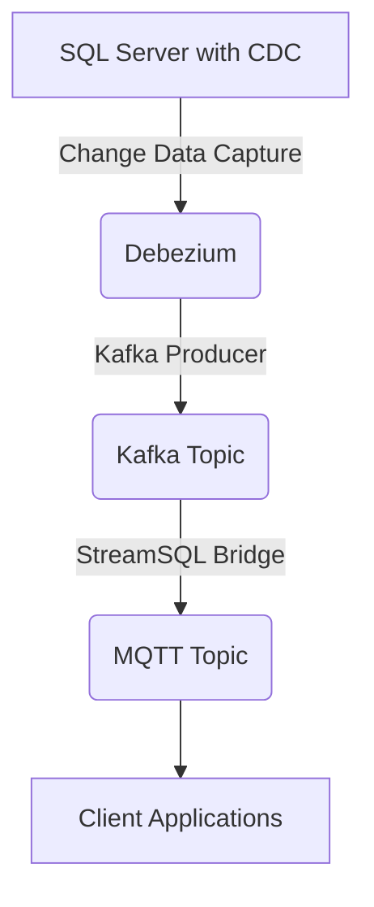

# StreamSQL - Real-time Database Change Pipeline

StreamSQL is a robust Change Data Capture (CDC) pipeline that leverages Kafka, Debezium, and MQTT to monitor and stream database changes to various consumers in real-time. This project enables seamless integration between SQL Server databases and client applications, ensuring low-latency data propagation.

## Table of Contents
- [StreamSQL - Real-time Database Change Pipeline](#streamsql---real-time-database-change-pipeline)
  - [Table of Contents](#table-of-contents)
  - [Overview](#overview)
  - [Architecture](#architecture)
  - [Components](#components)
  - [Prerequisites](#prerequisites)
  - [Installation](#installation)
    - [1. Clone the Repository](#1-clone-the-repository)
    - [2. Install Dependencies](#2-install-dependencies)
  - [Setting Up a Sample Database with CDC](#setting-up-a-sample-database-with-cdc)
    - [1. Create a Sample Database](#1-create-a-sample-database)
    - [2. Enable CDC on the Database](#2-enable-cdc-on-the-database)
    - [3. Configure SQL Server Agent](#3-configure-sql-server-agent)
    - [4. Test CDC](#4-test-cdc)
  - [Configuration](#configuration)
    - [Notes:](#notes)
  - [Running the Pipeline](#running-the-pipeline)
  - [Monitoring and Management](#monitoring-and-management)
    - [Viewing Logs](#viewing-logs)
  - [Troubleshooting](#troubleshooting)
    - [Common Issues](#common-issues)
    - [Debugging Tips](#debugging-tips)
  - [Contributing](#contributing)
  - [License](#license)
  - [Contact](#contact)

## Overview
StreamSQL captures real-time changes from a SQL Server database using Change Data Capture (CDC) and streams them through Apache Kafka to an MQTT broker (HiveMQ Cloud). This enables client applications to subscribe to database change events with minimal latency, making it ideal for scenarios like real-time analytics, event-driven architectures, and IoT integrations.

## Architecture
The pipeline follows a modular architecture to ensure scalability and reliability:



## Components
- **SQL Server with CDC**: The source database where Change Data Capture is enabled to track changes.
- **Debezium**: A CDC platform that captures row-level changes and streams them to Kafka.
- **Apache Kafka**: A distributed message broker ensuring reliable and scalable data streaming.
- **Kafka Connect**: A framework for integrating Kafka with external systems like Debezium and MQTT.
- **StreamSQL Bridge**: A custom Python service that forwards Kafka messages to an MQTT topic.
- **HiveMQ Cloud**: A managed MQTT broker for distributing messages to subscribed client applications.

## Prerequisites
Before setting up StreamSQL, ensure you have:
- **Docker** and **Docker Compose** installed.
- **SQL Server** (2019 or later) with CDC enabled on the target database and tables.
- Network access to the SQL Server instance and HiveMQ Cloud.
- **SQL Server Management Studio (SSMS)** or another SQL client for database setup.
- Basic knowledge of Kafka, MQTT, and database administration.

## Installation
Follow these steps to set up the StreamSQL pipeline:

### 1. Clone the Repository
```bash
git clone https://github.com/Leptons1618/StreamSQL.git
cd StreamSQL
```

### 2. Install Dependencies
Ensure Docker and Docker Compose are installed. No additional dependencies are required, as all services are containerized.

## Setting Up a Sample Database with CDC
To test StreamSQL, you can create a sample SQL Server database and enable CDC. Follow these steps using SQL Server Management Studio (SSMS) or a similar SQL client.

### 1. Create a Sample Database
Connect to your SQL Server instance and run the following SQL script to create a sample database and table:

```sql
-- Create a sample database
CREATE DATABASE SampleDB;
GO

-- Use the sample database
USE SampleDB;
GO

-- Create a sample table
CREATE TABLE dbo.Customers (
    CustomerID INT PRIMARY KEY IDENTITY(1,1),
    FirstName NVARCHAR(50),
    LastName NVARCHAR(50),
    Email NVARCHAR(100),
    CreatedAt DATETIME DEFAULT GETDATE()
);
GO

-- Insert sample data
INSERT INTO dbo.Customers (FirstName, LastName, Email)
VALUES 
    ('John', 'Doe', 'john.doe@example.com'),
    ('Jane', 'Smith', 'jane.smith@example.com');
GO
```

### 2. Enable CDC on the Database
CDC must be enabled at both the database and table levels. Run the following SQL commands:

```sql
USE SampleDB;
GO

-- Enable CDC on the database
EXEC sys.sp_cdc_enable_db;
GO

-- Verify CDC is enabled
SELECT name, is_cdc_enabled FROM sys.databases WHERE name = 'SampleDB';
GO

-- Enable CDC on the Customers table
EXEC sys.sp_cdc_enable_table
    @source_schema = N'dbo',
    @source_name = N'Customers',
    @role_name = NULL, -- No access restriction
    @supports_net_changes = 1; -- Enable net changes support
GO

-- Verify CDC is enabled for the table
SELECT name, is_tracked_by_cdc FROM sys.tables WHERE name = 'Customers';
GO
```

### 3. Configure SQL Server Agent
SQL Server Agent is required to run CDC cleanup and capture jobs. Ensure the SQL Server Agent is running and configured:

1. **Start SQL Server Agent**:
   - Open SSMS, connect to your SQL Server instance.
   - In Object Explorer, right-click **SQL Server Agent** and select **Start** if it’s not running.

2. **Verify CDC Jobs**:
   - After enabling CDC, two jobs are created automatically for the database:
     - `cdc.SampleDB_capture`: Captures changes from the transaction log.
     - `cdc.SampleDB_cleanup`: Removes old CDC data to prevent table growth.
   - In SSMS, navigate to **SQL Server Agent > Jobs** and confirm these jobs exist.

3. **Run CDC Jobs**:
   - Right-click the `cdc.SampleDB_capture` job and select **Start Job at Step**.
   - Ensure the job runs successfully (check the job history for errors).

4. **Schedule Cleanup Job** (Optional):
   - To automate cleanup, configure the `cdc.SampleDB_cleanup` job to run periodically:
     - In SSMS, right-click the `cdc.SampleDB_cleanup` job, select **Properties**.
     - Go to **Schedules**, create a new schedule (e.g., daily at midnight).
     - Save and enable the schedule.

### 4. Test CDC
Insert, update, or delete data in the `Customers` table to generate CDC events:

```sql
USE SampleDB;
GO

-- Insert a new record
INSERT INTO dbo.Customers (FirstName, LastName, Email)
VALUES ('Alice', 'Brown', 'alice.brown@example.com');
GO

-- Update an existing record
UPDATE dbo.Customers
SET Email = 'john.doe.updated@example.com'
WHERE CustomerID = 1;
GO

-- Delete a record
DELETE FROM dbo.Customers WHERE CustomerID = 2;
GO
```

You can query the CDC table to verify captured changes:

```sql
SELECT * FROM cdc.dbo_Customers_CT;
```

## Configuration
Create a `.env` file in the project root based on the provided `.env_example`. Update it to reference the sample database:

```plaintext
# Database Configuration
DB_HOSTNAME=your-db-server-address
DB_PORT=1433
DB_USER=your-db-username
DB_PASSWORD=your-db-password
DB_NAME=SampleDB
DB_SERVER_NAME=logical-server-name

# Tables to Monitor (comma-separated list)
TABLE_INCLUDE_LIST=dbo.Customers

# Kafka Configuration
KAFKA_BOOTSTRAP_SERVERS=kafka:29092
HISTORY_TOPIC=dbhistory.sampledb-cdc
TOPIC_NAME=sampledb-cdc-topic
RECOVERY_POLL_INTERVAL_MS=5000
RECOVERY_ATTEMPTS=4
TASKS_MAX=1
SNAPSHOT_MODE=initial

# Topic Creation Settings
TOPIC_CREATION_REPLICATION_FACTOR=1
TOPIC_CREATION_PARTITIONS=1
TOPIC_CREATION_ENABLE=true

# MQTT Configuration
MQTT_BROKER=your-mqtt-broker.hivemq.cloud
MQTT_PORT=8883
MQTT_USERNAME=your-mqtt-username
MQTT_PASSWORD=your-mqtt-password
MQTT_TOPIC=sampledb/customers
```

### Notes:
- Replace placeholder values (e.g., `your-db-server-address`) with actual values.
- Ensure `TABLE_INCLUDE_LIST` references `dbo.Customers` for the sample database.
- Use a secure password for MQTT and database credentials.

## Running the Pipeline
Start the pipeline using Docker Compose:

```bash
docker-compose up -d
```

This command starts all services (Kafka, Debezium, StreamSQL Bridge, etc.) in detached mode. To verify the services are running:

```bash
docker ps
```

## Monitoring and Management
Monitor the pipeline using the following tools:
- **Kafka UI**: Access at [http://localhost:8080](http://localhost:8080) to view topics and messages.
- **Kafka Connect**: Check connector status at [http://localhost:8083](http://localhost:8083).
- **HiveMQ Cloud Dashboard**: Visit [https://console.hivemq.cloud/](https://console.hivemq.cloud/) to monitor MQTT message statistics.

### Viewing Logs
To inspect logs for debugging:
```bash
docker logs streamsql_kafka-connect_1
```

## Troubleshooting
### Common Issues
- **No messages flowing**:
  - Ensure CDC is enabled on the `SampleDB` database and `Customers` table.
  - Verify the `TABLE_INCLUDE_LIST` in the `.env` file is set to `dbo.Customers`.
  - Confirm the SQL Server Agent is running and the `cdc.SampleDB_capture` job is active.
- **Connector failures**:
  - Check Kafka Connect logs for errors (`docker logs streamsql_kafka-connect_1`).
  - Ensure `KAFKA_BOOTSTRAP_SERVERS` is correctly configured.
- **MQTT connection issues**:
  - Verify MQTT credentials and network connectivity to the HiveMQ Cloud broker.
  - Check the `MQTT_BROKER` and `MQTT_PORT` settings.

### Debugging Tips
- Increase `RECOVERY_ATTEMPTS` in the `.env` file if connectors fail intermittently.
- Use the Kafka UI to inspect message flow in the `sampledb-cdc-topic` topic.
- Test MQTT connectivity using an MQTT client like [MQTT Explorer](https://mqtt-explorer.com/).
- Query the CDC table (`cdc.dbo_Customers_CT`) to confirm change capture.

## Contributing
Contributions are welcome! To contribute:
1. Fork the repository.
2. Create a feature branch (`git checkout -b feature/your-feature`).
3. Commit your changes (`git commit -m "Add your feature"`).
4. Push to the branch (`git push origin feature/your-feature`).
5. Open a Pull Request.

Please ensure your code follows the project's coding standards and includes appropriate tests.

## License
This project is licensed under the MIT License. See the [LICENSE](LICENSE) file for details.

## Contact
For questions, bug reports, or support, please contact [anishgiri163@gmail.com](mailto:anishgiri163@gmail.com) or open an issue on the [GitHub repository](https://github.com/Leptons1618/StreamSQL).